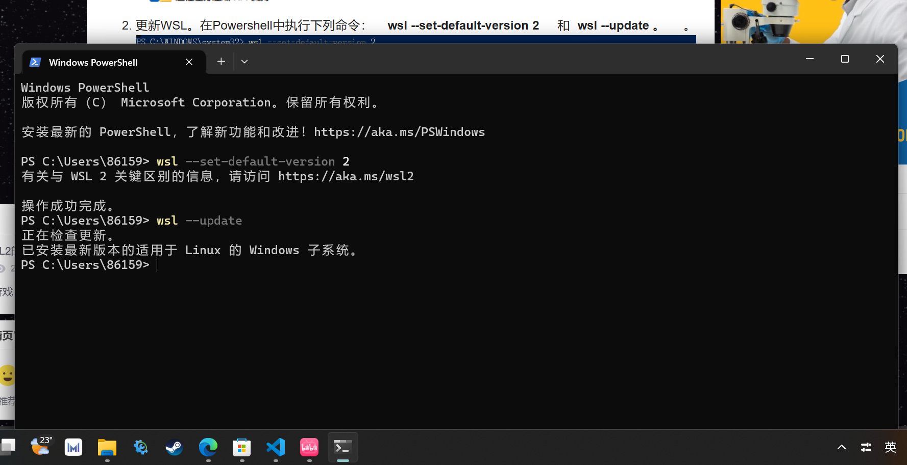

# 安装配置WSL2的UBUNTU发行版过程[^过程]

## 一、安装wsl2

首先根据教程进行系统设置。

重启后更新wsl。

## 二、安装UBUNTU

在Windows应用商店搜索安装ubuntu

完成后打开，根据提示设置账号密码(第一次输密码的时候我还以为键盘坏了)

## 三、跟据教程继续配置

1.设置根目录密码
    
2.根据教程使用apt清华源
设置apt国内镜像源以加速下载，使用nano编辑/etc/apt/sources.list。

更新镜像和所有包：

    sudo apt upgrade
    sudo apt upgrade

## 四、个人感想

这是我完成的第一个题目，它锻炼了我的信息检索能力，并且在查阅资料的过程中我也学到了很多。

[^过程]:参考教程：<https://zhuanlan.zhihu.com/p/600519231>
<https://blog.csdn.net/ljw_study_in_CSDN/article/details/129752865>
